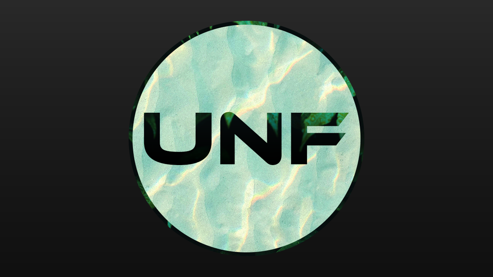

<h1 align="center">Hi , I'm Sam</h1>
<h3 align="center">Professional programmer in the making, also love designing lots of stuff. </h3>

 
 

## 🙋‍♂️ About Me

- 🔭 I am currently working on [my website portfolio](https://github.com/unfinishedd/Portfolio-Website)

- 👨‍ My projects are available at [projects](https://github.com/unfinishedd?tab=repositories)

- 💬 You can ask me about **HTML, CSS, C#, JAVASCRIPT, PHP, PYTHON**

 
 

## 🛠 Languages and Tools:

 
    
    
    
    
    
    <a href="https://www.python.org" target="_blank"> 

 
 

    

 
 

## 📊 My Github Stats

   
  	
  	
   
  <b>	Note:</b> The top languages are only a metric of the languages my public code consists of and do not reflect experience or skill level.

 
 

 
 

## ❤ Views and Followers

